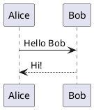

# Module markdown-pdf

[](https://github.com/vb64/markdown-pdf/actions?query=workflow%3Apep257)
[](https://github.com/vb64/markdown-pdf/actions?query=workflow%3Apy3)
[](https://app.codacy.com/gh/vb64/markdown-pdf/dashboard?utm_source=gh&utm_medium=referral&utm_content=&utm_campaign=Badge_grade)
[](https://app.codacy.com/gh/vb64/markdown-pdf/dashboard?utm_source=gh&utm_medium=referral&utm_content=&utm_campaign=Badge_coverage)
[](https://pypistats.org/packages/markdown-pdf)

The free, open source Python module `markdown-pdf` will create a PDF file from your `markdown` content.

When creating a PDF file you can:

- Use `UTF-8` encoded text in `markdown` in any language
- Embed images used in `markdown`
- Break text into pages in the desired order
- Create a TableOfContents (bookmarks) from markdown headings
- Tune the necessary elements using your CSS code
- Use different page sizes within single pdf
- Create tables in `markdown`
- Use clickable hyperlinks. Thanks a lot [@thongtmtrust](https://github.com/thongtmtrust) for ideas and collaboration.
- Render plantuml and mermaid code to pdf images with [plugins](pligins.md).

The module utilizes the functions of two great libraries.

- [markdown-it-py](https://github.com/executablebooks/markdown-it-py) to convert `markdown` to `html`.
- [PyMuPDF](https://github.com/pymupdf/PyMuPDF) to convert `html` to `pdf`.

## Installation

```bash
pip install markdown-pdf
```

## Usage

Create a compressed pdf with TOC (bookmarks) from headings up to level 2.

```python
from markdown_pdf import MarkdownPdf

pdf = MarkdownPdf(toc_level=2, optimize=True)
```

Add the first section to the pdf. The title is not included in the table of contents.

```python
from markdown_pdf import Section

pdf.add_section(Section("# Title\n", toc=False))
```

Add a second section with external and internal hyperlinks.
In the pdf file it starts on a new page.

```python
text = """# Section with links

- [External link](https://github.com/vb64/markdown-pdf)
- [Internal link to Head1](#head1)
- [Internal link to Head3](#head3)
"""

pdf.add_section(Section(text))
```

Add a third section.
The title is centered using CSS, included in the table of contents of the pdf file, and an image from the file `img/python.png` is embedded on the page.

```python
pdf.add_section(
  Section("# <a name='head1'></a>Head1\n\n\n\nbody\n"),
  user_css="h1 {text-align:center;}"
)
```

Add a next section. Two headings of different levels from this section are included in the TOC of the pdf file.
The section has landscape orientation of A4 pages.

```python
pdf.add_section(Section("## Head2\n\n### <a id='head3'></a>Head3\n\n", paper_size="A4-L"))
```

Add a section with a table.

```python

text = """# Section with Table

|TableHeader1|TableHeader2|
|--|--|
|Text1|Text2|
|ListCell|<ul><li>FirstBullet</li><li>SecondBullet</li></ul>|
"""

css = "table, th, td {border: 1px solid black;}"

pdf.add_section(Section(text), user_css=css)
```

Set the properties of the pdf document.

```python
pdf.meta["title"] = "User Guide"
pdf.meta["author"] = "Vitaly Bogomolov"
```

Save to file.

```python
pdf.save("guide.pdf")
```

Or save to file-like object.

```python
import io

out = io.BytesIO()
pdf.save_bytes(out)
assert out.getbuffer().nbytes > 0
```


## Settings and options

The `Section` class defines a portion of `markdown` data,
which is processed according to the same rules.
The next `Section` data starts on a new page.

The `Section` class can set the following attributes.

- toc: whether to include the headers `<h1>` - `<h6>` of this section in the TOC. Default is True.
- root: the name of the root directory from which the image file paths starts in markdown. Default ".".
- paper_size: either the name of a paper size, [as described here](https://pymupdf.readthedocs.io/en/latest/functions.html#paper_size), or a list/tuple containing the width and height in mm. Default "A4".
- borders: size of borders. Default (36, 36, -36, -36).

The following document properties are available for assignment (dictionary `MarkdownPdf.meta`) with the default values indicated.

- `creationDate`: current date
- `modDate`: current date
- `creator`: "PyMuPDF library: https://pypi.org/project/PyMuPDF"
- `producer`: ""
- `title`: ""
- `author`: ""
- `subject`: ""
- `keywords`: ""

## Plugins

The module allows you to process specially marked sections of code using plugins.

For example, you convert the following Markdown text to PDF:

````markdown
# Title plantuml

Document with plantuml code.



End of document
````

Without using the plugin, you will get the following result in pdf:


You can use a plugin to render plantuml code into an image.

````python
from markdown_pdf import MarkdownPdf, Section
from markdown_pdf.pligins import Plugin

plantuml_text = """# Title plantuml

Document with plantuml code.


End of document
"""

plugins = {
  Plugin.Plantuml: {'url': 'http://www.plantuml.com/plantuml/img/'}
}

pdf = MarkdownPdf(plugins=plugins)
pdf.add_section(Section(plantuml_text))
pdf.save("plantuml.pdf")
````

In this case, the plugin will send the code marked as `plantuml` to the specified internet server
and replace the code text with an image generated by the server `www.plantuml.com`.

In the created file `plantuml.pdf`, you will see the following result:


## Example

As an example, you can download the [pdf file](examples/markdown_pdf.pdf) created from this md file.
This [Python script](makepdf.py) was used to create the PDF file.

## Development

```bash
git clone git@github.com:vb64/markdown-pdf.git
cd markdown-pdf
make setup PYTHON_BIN=/path/to/python3
make tests
```
