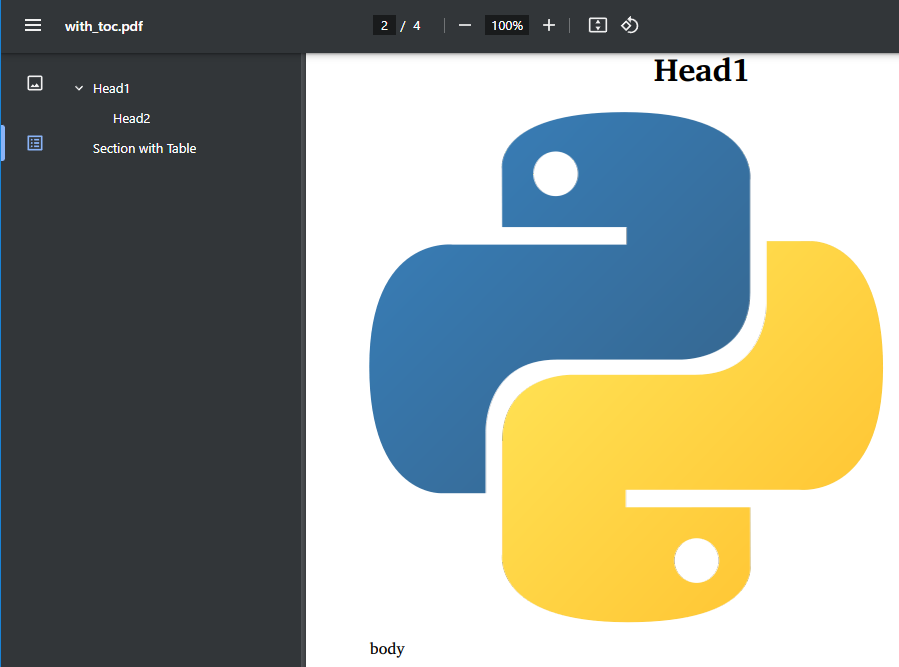

# Module markdown-pdf

[](https://github.com/vb64/markdown-pdf/actions?query=workflow%3Apep257)
[](https://github.com/vb64/markdown-pdf/actions?query=workflow%3Apy3)
[](https://app.codacy.com/gh/vb64/markdown-pdf/dashboard?utm_source=gh&utm_medium=referral&utm_content=&utm_campaign=Badge_grade)
[](https://app.codacy.com/gh/vb64/markdown-pdf/dashboard?utm_source=gh&utm_medium=referral&utm_content=&utm_campaign=Badge_coverage)

The free, open source Python module `markdown-pdf` will create a PDF file from your content in `markdown` format.

When creating a PDF file you can:

- Use `UTF-8` encoded text in `markdown` in any language
- Embed images used in `markdown`
- Break text into pages in the desired order
- Create a TableOfContents (bookmarks) from markdown headings
- Tune the necessary elements using your CSS code

The module utilizes the functions of two great libraries.

- [markdown-it-py](https://github.com/executablebooks/markdown-it-py) to convert `markdown` to `html`.
- [PyMuPDF](https://github.com/pymupdf/PyMuPDF) to convert `html` to `pdf`.

## Installation

```bash
pip install markdown-pdf
```

## Usage

Create a pdf with TOC (bookmarks) from headings up to level 2.

```python
from markdown_pdf import MarkdownPdf

pdf = MarkdownPdf(toc_level=2)
```

Add three sections of markdown to the pdf.
Each section starts on a new page.
Headings from the first section are not included in the TOC.
The second section header is centered using CSS
and the image from the file `img/python.png` is embedded on the PDF page.

```python
from markdown_pdf import Section

pdf.add_section(Section("# Title\n", toc=False))
pdf.add_section(
  Section("# Head1\n\n\n\nbody\n"),
  user_css="h1 {text-align:center;}"
)
pdf.add_section(Section("## Head2\n\n### Head3\n\n"))
```

Set the properties of the pdf document.

```python
pdf.meta["title"] = "User Guide"
pdf.meta["author"] = "Vitaly Bogomolov"
```

Save to file.

```python
pdf.save("guide.pdf")
```



## Settings and options

The `Section` class defines a portion of `markdown` data,
which is processed according to the same rules.
The next `Section` data starts on a new page.

The `Section` class can set the following attributes.

- toc: whether to include the headers `<h1>` - `<h6>` of this section in the TOC. Default is True.
- root: the name of the root directory from which the image file paths starts in markdown. Default ".".
- paper_size: name of paper size, [as described here](https://pymupdf.readthedocs.io/en/latest/functions.html#paper_size). Default "A4".
- borders: size of borders. Default (36, 36, -36, -36).

The following document properties are available for assignment (dictionary `MarkdownPdf.meta`) with the default values indicated.

- `creationDate`: current date
- `modDate`: current date
- `creator`: "PyMuPDF library: https://pypi.org/project/PyMuPDF"
- `producer`: ""
- `title`: ""
- `author`: ""
- `subject`: ""
- `keywords`: ""

## Example

As an example, you can download the [pdf file](examples/markdown_pdf.pdf) created from this md file.
This [Python script](makepdf.py) was used to create the PDF file.
