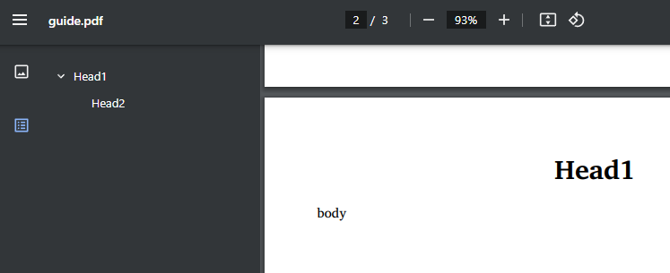
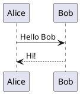
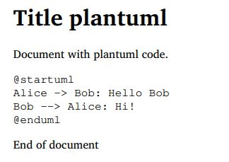
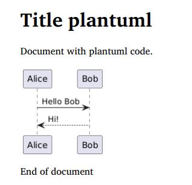

# Модуль markdown-pdf

Бесплатный, с открытым исходным кодом Python модуль `markdown-pdf` позволит создать PDF файл из вашего контента в формате `markdown`.

При создании PDF файла вы можете:

- Использовать в `markdown` текст на любом языке в кодировке `UTF-8`
- Встраивать используемые в `markdown` картинки
- Разбивать текст на страницы в нужном порядке
- Создавать оглавление (bookmarks) из заголовков markdown
- Оформлять нужные элементы при помощи вашего CSS кода
- Использовать разные размеры страниц внутри одного pdf
- Создавать таблицы в `markdown`
- Использовать кликабельные гиперссылки. Спасибо [@thongtmtrust](https://github.com/thongtmtrust) за идеи и сотрудничество!
- Использовать плагин для контента plantuml

Модуль использует функции двух замечательных библиотек.

- [markdown-it-py](https://github.com/executablebooks/markdown-it-py) для преобразования `markdown` в `html`.
- [PyMuPDF](https://github.com/pymupdf/PyMuPDF) для преобразования `html` в `pdf`.

## Установка

```bash
pip install markdown-pdf
```

## Использование

Создаем pdf с оглавлением (bookmarks) из заголовков до 2 уровня.

```python
from markdown_pdf import MarkdownPdf

pdf = MarkdownPdf(toc_level=2)
```

Добавляем в pdf первую секцию. Заголовок не включаем в оглавление.

```python
from markdown_pdf import Section

pdf.add_section(Section("# Title\n", toc=False))
```

Добавляем вторую секцию с внешними и внутренними гипер-ссылками.
В pdf-файле она начинается с новой страницы.

```python
text = """# Section with links

- [External link](https://github.com/vb64/markdown-pdf)
- [Internal link to Head1](#head1)
- [Internal link to Head3](#head3)
"""

pdf.add_section(Section(text))
```

Добавляем третью секцию.
Заголовок центрируется при помощи CSS, включается в оглавление pdf-файла и на страницу встраивается изображение из файла `img/python.png`.

```python
pdf.add_section(
  Section("# <a name='head1'>Head1\n\n\n\nbody\n"),
  user_css="h1 {text-align:center;}"
)
```

Добавляем следующую секцию. Два заголовка разного уровня из этой секции включаются в оглавление pdf-файла.
Секция имеет альбомную ориентацию страниц A4.

```python
pdf.add_section(Section("## Head2\n\n### <a id='head3'></a>Head3\n\n", paper_size="A4-L"))
```

Добавляем секцию с таблицей.

```python

text = """# Section with Table

|TableHeader1|TableHeader2|
|--|--|
|Text1|Text2|
|ListCell|<ul><li>FirstBullet</li><li>SecondBullet</li></ul>|
"""

css = "table, th, td {border: 1px solid black;}"

pdf.add_section(Section(text), user_css=css)
```

Устанавливаем свойства pdf документа.

```python
pdf.meta["title"] = "Руководство пользователя"
pdf.meta["author"] = "Виталий Богомолов"
```

Сохраняем в файл.

```python
pdf.save("guide.pdf")
```

Либо сохраняем в буфер памяти.

```python
import io

out = io.BytesIO()
pdf.save_bytes(out)
assert out.getbuffer().nbytes > 0
```



## Настройки и опции

Класс `Section` задает порцию данных `markdown`, которые обрабатываются по единым правилам.
Данные следующего `Section` начинаются с новой страницы.

У класса `Section` можно задавать следующие атрибуты.

- toc: нужно ли включать заголовки `<h1>` - `<h6>` этой секции в TOC. По умолчанию True.
- root: имя корневого каталога, от которого начинаются пути файлов картинок в markdown. По умолчанию ".".
- paper_size: название размера бумаги, [как описано здесь](https://pymupdf.readthedocs.io/en/latest/functions.html#paper_size), или list/tuple содержащий ширину и высоту в мм. По умолчанию "A4".
- borders: размер полей. По умолчанию (36, 36, -36, -36).

Для присвоения доступны следующие свойства документа (словарь `MarkdownPdf.meta`) с указанными значениями по умолчанию.

- `creationDate`: текущая дата
- `modDate`: текущая дата
- `creator`: "PyMuPDF library: https://pypi.org/project/PyMuPDF"
- `producer`: ""
- `title`: ""
- `author`: ""
- `subject`: ""
- `keywords`: ""

## Плагины

Модуль позволяет обрабатывать специально помеченные разделы кода при помощи плагинов.

Например, вы преобразуете в pdf следующий текст markdown:

````markdown
# Title plantuml

Document with plantuml code.



End of document
````

Без использования плагина вы получите следующий результат в pdf:



Вы можете использовать плагин для рендеринга кода plantuml в изображение.

````python
from markdown_pdf import MarkdownPdf, Section
from markdown_pdf.pligins import Plugin

plantuml_text = """# Title plantuml

Document with plantuml code.


End of document
"""

plugins = {
  Plugin.Plantuml: {'url': 'http://www.plantuml.com/plantuml/img/'}
}

pdf = MarkdownPdf(plugins=plugins)
pdf.add_section(Section(plantuml_text))
pdf.save("plantuml.pdf")
````

В этом случае плагин передаст помеченный как `plantuml` код на указанный сервер в сети интернет
и заменит текст кода на изображение, которое создаст сервер `www.plantuml.com`.

В созданном файле `plantuml.pdf` вы получите следующий результат:



## Пример

В качестве примера вы можете загрузить созданный из этого md файла [pdf файл](examples/markdown_pdf_ru.pdf).
Для создания pdf файла использовался [этот скрипт](makepdf.py) Python.

## Разработка

```bash
git clone git@github.com:vb64/markdown-pdf.git
cd markdown-pdf
make setup PYTHON_BIN=/path/to/python3
make tests
```
