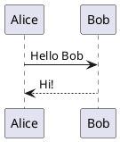
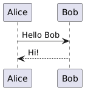
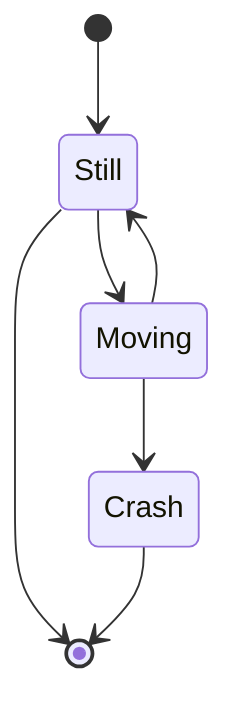
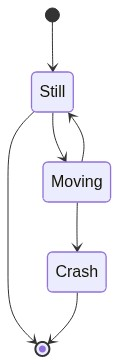

# Plugins

Markdown-pdf can process content marked with special code using plugins.
A plugin can convert the code it's intended for into images or other content.

You can use the following plugins out of the box with `markdown-pdf`.

## plantuml

The `plantuml` plugin replaces given code with an image of the corresponding diagram, generated using an external server (by default, `http://www.plantuml.com`).

Your `markdown` document contains the following code snippet.

````markdown

````

You can use a plugin to convert the diagram into an image.

```python
from markdown_pdf import MarkdownPdf, Section
from markdown_pdf.pligins import Plugin

plugins = {
  # use defaults
  Plugin.Plantuml: None
  # or specify your server address
  # Plugin.Plantuml: {'url': 'http://www.plantuml.com/plantuml/img/'}
}

pdf = MarkdownPdf(plugins=plugins)
pdf.add_section(Section(markdown_text_with_plantuml_code))
pdf.save("plantuml.pdf")
```

In the resulting PDF file, the code `plantuml` will be replaced with the following image.



## mermaid

The `mermaid` plugin replaces code with an image generated by an external server (`https://mermaid.ink` by default).

Your `markdown` document contains the following code snippet.

````

````

You can use a plugin to convert this code into an image.

```python
from markdown_pdf import MarkdownPdf, Section
from markdown_pdf.pligins import Plugin

plugins = {
  # use defaults
  Plugin.Mermaid: None
  # or specify your server address
  # Plugin.Mermaid: {'url': 'https://mermaid.ink/img/'}
}

pdf = MarkdownPdf(plugins=plugins)
pdf.add_section(Section(markdown_text_with_mermaid_code))
pdf.save("mermaid.pdf")
```

In the resulting PDF file, the code `mermaid` will be replaced with the following image.


