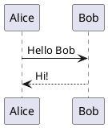
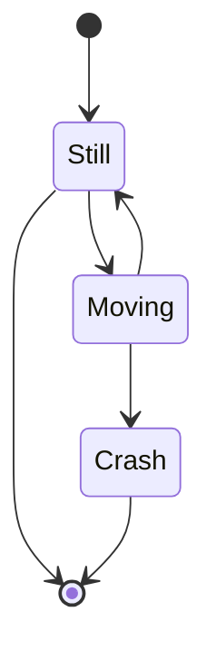

# Плагины

Markdown-pdf может обрабатывать помеченный специальным кодом контент при помощи плагинов.
Плагин может преобразовывать предназначенный для него код в изображения или другой контент.

В `markdown-pdf` вы можете использовать следующие плагины "из коробки".

## plantuml

Плагин для кода `plantuml` заменяет код на картинку соответствующей схемы, создаваемую при помощи внешнего сервера (по умолчанию `http://www.plantuml.com`).

В вашем `markdown` документе имеется следующий фрагмент кода.

````

````

Вы можете использовать плагин для преобразования в картинку схемы.

```python
from markdown_pdf import MarkdownPdf, Section
from markdown_pdf.pligins import Plugin

plugins = {
  # использовать умолчания
  Plugin.Plantuml: None
  # или задать адрес вашего сервера
  # Plugin.Plantuml: {'url': 'http://www.plantuml.com/plantuml/img/'}
}

pdf = MarkdownPdf(plugins=plugins)
pdf.add_section(Section(markdown_text_with_plantuml_code))
pdf.save("plantuml.pdf")
```

В полученном pdf файле код `plantuml` будет заменен на следующую картинку.


## mermaid

Плагин для кода `mermaid` заменяет код на картинку, создаваемую при помощи внешнего сервера (по умолчанию `https://mermaid.ink`).

В вашем `markdown` документе имеется следующий фрагмент кода.

````

````

Вы можете использовать плагин для преобразования этого кода в картинку.

```python
from markdown_pdf import MarkdownPdf, Section
from markdown_pdf.pligins import Plugin

plugins = {
  # использовать умолчания
  Plugin.Mermaid: None
  # или задать адрес вашего сервера
  # Plugin.Mermaid: {'url': 'https://mermaid.ink/img/'}
}

pdf = MarkdownPdf(plugins=plugins)
pdf.add_section(Section(markdown_text_with_mermaid_code))
pdf.save("mermaid.pdf")
```

В полученном pdf файле код `mermaid` будет заменен на следующую картинку.


